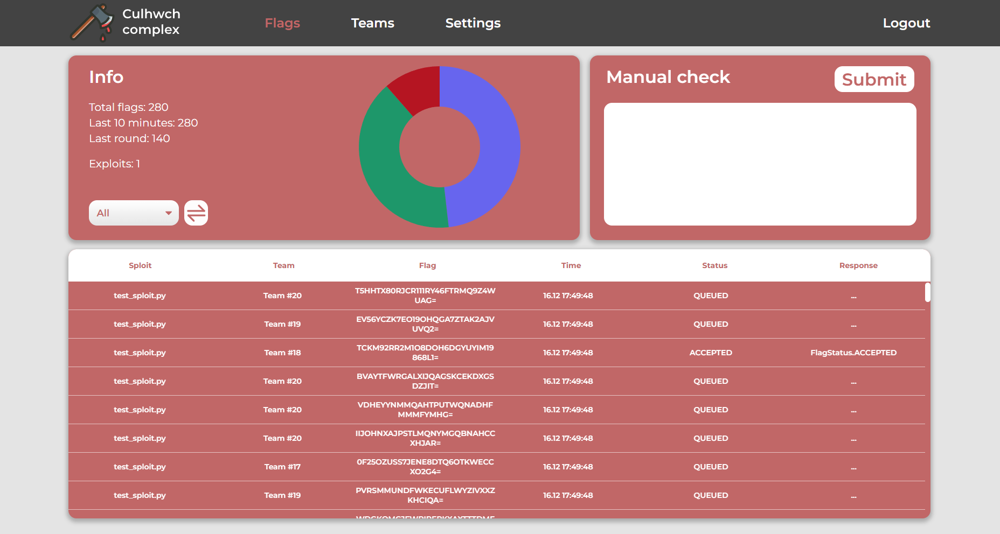
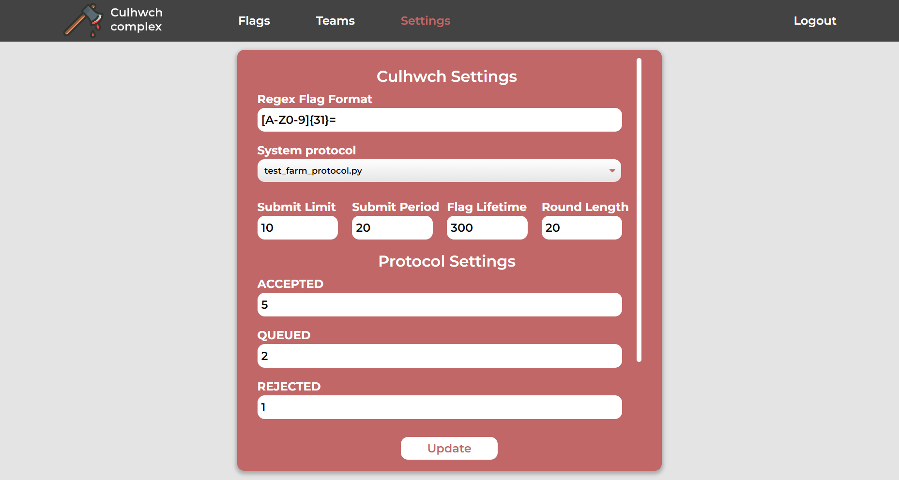
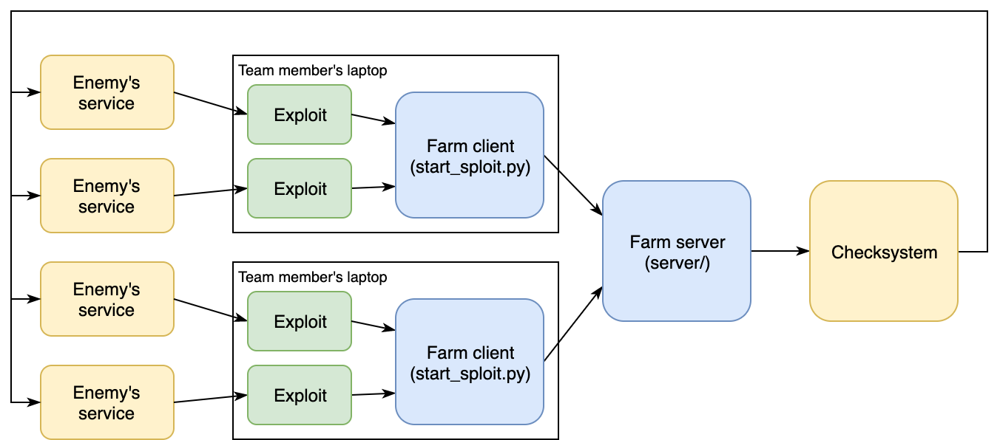

# CulhwchFarm

    Language: <b>English</b> | <a href="https://github.com/arkiix/CulhwchFarm/blob/main/resources/READMEru.md">Русский</a>

CulhwchFarm is a flexible and convenient Attack/Defense CTF farm. Inspired by [DestructiveFarm](https://github.com/DestructiveVoice/DestructiveFarm) and [S4DFarm](https://github.com/C4T-BuT-S4D/S4DFarm).

## Running
- Change the password in [compose.yml](./compose.yml). (SERVER_PASSWORD)
- Execute `docker compose up --build -d` or `make start`
- After the build, the farm will be available at http://localhost:8893

## Scripts
The farm's capabilities can be customized and expanded using scripts: protocols and validators.

If additional parameters need to be added to a script, the first line should contain a comment with them, for example, `# params: SYSTEM_HOST, SYSTEM_PORT`. These parameters can be configured through the web interface, and the script can retrieve them from the configuration, for example, `host = config.get('SYSTEM_HOST')`.

Culhwch automatically detects script changes and processes them when the settings are opened in the web interface.

### Protocols
[Protocols](./server/api/protocols) are used for the farm to work with the scoring system (flag submission). The protocol should implement the function `submit_flags(flags: list[Flag], config: dict)` that returns a generator.

### Validators
[Validators](./server/api/validators) are used to filter and modify flags entering the farm. The validator should implement an asynchronous function `async def validate_flags(flags: Iterator[Flag], app, config: dict)` that returns an asynchronous generator.

## Web Interface
### Flags
The Flags page provides statistics on exploits and the ability to manually submit a flag.

### Teams
The Teams page allows managing teams:
- Deleting teams
- Adding teams
- Generating teams

### Settings
The Settings page allows managing farm settings:
- Configuring default variables
- Selecting and configuring protocols
- Enabling/disabling validators and configuring their parameters

## API
The farm API allows automating certain tasks, such as managing settings and the team list (e.g., [team_parsers](./client/team_parsers)).

## Exploits
Exploits are written to attack enemy teams, steal flags, and submit them to the farm.

To launch an exploit, use [start_sploit.py](./client/start_sploit.py), for example:
> python3 start_sploit.py sploit.py

